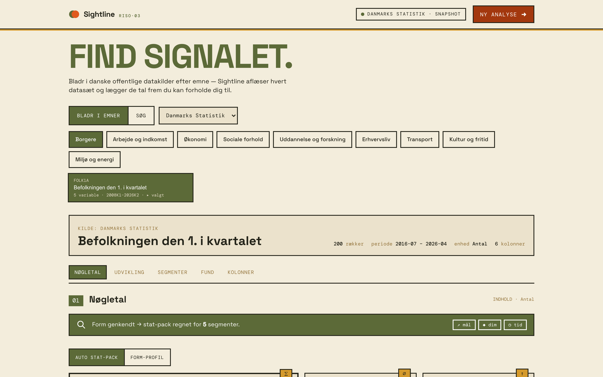
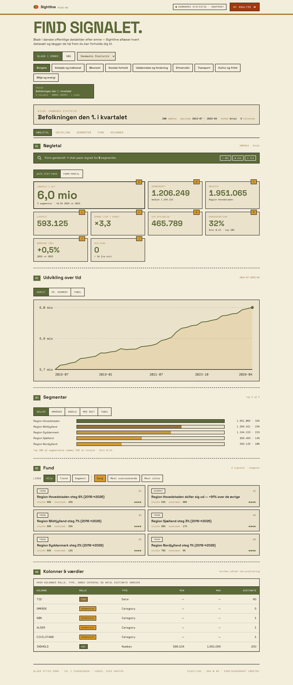
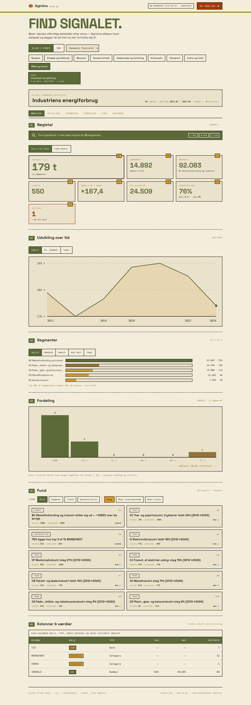

# Sightline

A data exploration tool for Danish open data. Pick a source, browse by topic, point at a dataset — Sightline profiles the columns, computes a stat-pack, and ranks the signals worth looking at (trend, anomaly, segment, correlation, concentration).

**Live demo:** [sightline-gamma.vercel.app](https://sightline-gamma.vercel.app)
**Stack:** React 19 · TypeScript 6 · Vite 8 · Recharts · .NET 10 · ASP.NET Core · Scalar



---

## What it does

- **Two live sources.** Danmarks Statistik (subject-tree navigation + free-text search) and Open Data DK (CKAN). Pluggable behind one `IDataSource` interface.
- **Auto-profile per dataset.** Every column gets a role (`Mål` / `Dimension` / `Tid`) and a type. The UI adapts: time series get a trend chart, dimensions get bar / waffle / area views, numerics get a histogram.
- **Stat-pack at a glance.** Sum, mean, median, min, max, span ratio, std-dev, top-segment share, Gini, year-over-year, outlier count — computed server-side in one pass.
- **Ranked findings.** Five scanners (trend, anomaly, segment, correlation, concentration) produce findings; the ranker mixes them on *strength · surprise · confidence · coverage*.
- **Lens selector.** Bias the feed toward what you want to see (`stærk`, `overraskende`, `tids-trends`, `koncentration` …) without re-querying.

---

## Screen tour

**Stat-pack — FOLK1A (Befolkningen den 1. i kvartalet).** Hero numbers, then the trend chart, segment breakdown, ranked findings, and column table.



**Concentration story — ENEBR (Industriens energiforbrug).** Gini 0,67 means a few industries dominate; the segment view and findings surface that directly.



---

## How it's built

```
React + TS (Vite)  ──▶  .NET 10 API  ──http──▶  Danmarks Statistik · Open Data DK
                          │
                          ├─ DstConnector / OpenDataDkConnector  (List, Fetch)
                          ├─ ColumnProfiler                       (role + type inference)
                          ├─ StatsService                         (stat-pack aggregation)
                          └─ SignalEngine + 5 Scanners + Ranker   (findings + interestingness)
```

The connectors return a `Dataset` (rows + typed columns). Every downstream service is pure: ColumnProfiler, StatsService, and each scanner take a `Dataset` and return a structured result. Memory cache keeps the same dataset profile across the four endpoints (profile / findings / stats) so the UI flow is one round-trip per click.

| Decision | Why |
|---|---|
| `IDataSource` boundary | Adding another open-data API is one connector + DI registration. The profiler, stats, and scanners don't care about the source. |
| Server-computed stat-pack | The aggregation is heavy; pushing it client-side would mean shipping every row. The API returns the summary, the UI just renders. |
| Findings = pure functions | Each scanner is `(Dataset) -> IEnumerable<Finding>`. Tested in isolation, no mocks. |
| Per-finding `Interestingness` | One ranker mixes strength, surprise, confidence, coverage. Re-ranking by lens is a client-side sort, no extra request. |
| Hybrid demo build | `VITE_USE_FIXTURES=true` swaps the api-client to bundled JSON snapshots so the Vercel build runs without a backend. |

---

## Quality

- 21 / 21 backend tests green (`dotnet test`)
- Strict TypeScript · ESLint clean
- 40 modules · ~280 kB JS / 15 kB CSS in the static demo build
- Live (full-stack) and demo (static) modes share one frontend bundle, swapped by a build-time flag

---

## Run locally

### Full stack (live data from DST + Open Data DK)

Requires .NET 10 SDK and Node 20+.

```bash
# 1. Backend → http://localhost:5174  (API explorer at /scalar/v1)
dotnet run --project backend/Sightline.Api

# 2. Frontend → http://localhost:5173
cd frontend && npm install && npm run dev
```

### Demo build (no backend, snapshots only)

```bash
cd frontend && VITE_USE_FIXTURES=true npm run build && npm run preview
```

The bundled snapshots cover four datasets — FOLK1A, BIL55, ENEBR (Danmarks Statistik) and Trafiktal (Open Data DK) — captured on 2026-05-26.

### Tests

```bash
dotnet test                   # backend: 21/21
cd frontend && npm run lint   # frontend: 0 errors
```

---

## API

| Endpoint | Description |
|---|---|
| `GET /api/sources` | Configured sources (DST, Open Data DK). |
| `GET /api/sources/{source}/subjects` | Browsable topics. Empty for sources without a tree (Open Data DK). |
| `GET /api/sources/{source}/datasets?q=&subject=` | Discover datasets by topic or free text. |
| `GET /api/datasets/{source}/{id}` | Fetch + profile (`DatasetProfile`). |
| `GET /api/findings/{source}/{id}` | Ranked findings from the signal engine. |
| `GET /api/stats/{source}/{id}` | Stat-pack: hero numbers, series, segments, histogram, segment-series. |

Live API explorer in dev: `http://localhost:5174/scalar/v1`.

---

## What's intentionally not here

- **No authentication.** Public open data only; no per-user state.
- **No persistence.** Every request fetches live (or, in demo mode, reads a bundled snapshot). No database.
- **No write path.** Read-only by design — Sightline interprets, it doesn't ingest.
- **No mobile-first layout.** Desktop tool; responsive but not optimized.
